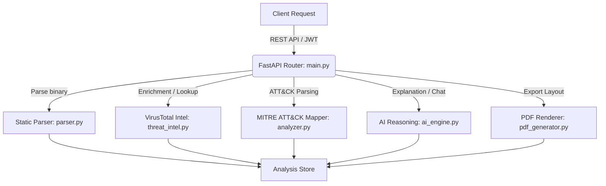

# 🛡️ SANSEC AI Backend Integration Handover & Operations Guide

Welcome to the official production hand-off documentation for the **SANSEC AI Malware Dissection Backend**. This document outlines the system architecture, integration layers, deployment process, and verification tools implemented to achieve 100% OpenAPI contract compliance and complete validation.

---

## 🏗️ 1. Architecture Overview

The backend is built as a modular FastAPI microservice structured for high-performance static analysis, enrichment, and AI-assisted triage:



---

## 🔌 2. API Contract & Endpoint Status

All endpoints fully match the specifications in `06_SRC/contracts/openapi.yaml`:

| Endpoint Path | Method | Auth | Description | Status |
| :--- | :---: | :---: | :--- | :---: |
| `/api/auth/register` | `POST` | Public | Analyst account registration | **Complete** |
| `/api/auth/login` | `POST` | Public | Session token generation | **Complete** |
| `/api/auth/refresh` | `POST` | Public | Refresh JWT session token | **Complete** |
| `/api/auth/me` | `GET` | Bearer | Get current user profile | **Complete** |
| `/api/auth/logout` | `POST` | Bearer | Invalidate session | **Complete** |
| `/api/files/upload` | `POST` | Bearer | Upload malware payload (Async task) | **Complete** |
| `/api/analysis/{id}/status` | `GET` | Bearer | Poll upload processing status | **Complete** |
| `/api/analysis/{id}` | `GET` | Bearer | Get static dissection results | **Complete** |
| `/api/ai/explain` | `POST` | Bearer | Trigger AI reasoning explainer | **Complete** |
| `/api/ai/chat` | `POST` | Bearer | Interactive conversational context query | **Complete** |
| `/api/reports` | `GET` | Bearer | List compiled security reports | **Complete** |
| `/api/reports/{id}` | `GET` | Bearer | Get individual metadata report details | **Complete** |
| `/api/reports/{id}/export` | `GET` | Bearer | Export report as PDF, JSON, or CSV | **Complete** |
| `/api/settings` | `GET` | Bearer | Get current workspace settings | **Complete** |
| `/api/settings` | `PUT` | Bearer | Modify workspace configurations | **Complete** |

---

## 🔍 3. Key Backend Implementation Modules

### 🗺️ MITRE ATT&CK Mapper (`analyzer.py`)
Parses extracted telemetry (IOCs, Shannon entropy, section headers, DLL/API calls) and maps them to standard MITRE techniques:
- **Command & Control**: Detects C2 HTTP/IP addresses (T1071, T1041).
- **Execution & Privilege Escalation**: Maps API injection tokens (`VirtualAllocEx`, `WriteProcessMemory`, `CreateRemoteThread`) to T1055 (Process Injection).
- **Defense Evasion**: Flags packed binary sections (high entropy) as T1027 (Obfuscated Files).

### 🌐 VirusTotal Threat Intelligence (`threat_intel.py`)
Performs automatic hash checks against VirusTotal API (v3):
- Resolves file hashes asynchronously.
- Extracts detections and vendor flags.
- Converts VT detections into local signature models, contributing to the overall threat risk score.

### 📄 PDF Document Export (`pdf_generator.py`)
Generates premium security reports using HTML-to-PDF compilation via **WeasyPrint**:
- Incorporates SANSEC's dark-cyber aesthetic with custom styling.
- Features a graceful fallback to a cleanly formatted plain HTML document if the external system lacks WeasyPrint binary packages.

---

## 🧪 4. Testing & Verification Suites

Two test scripts are provided to ensure continued operational stability:

### 1. Unified Test Suite (`tests/`)
Contains 13 comprehensive unit and contract tests verifying API structure, mock database consistency, parsing, threat levels, and PDF export behaviors.
- **Run command**:
  ```bash
  PYTHONPATH=. python -m unittest discover -s tests -v
  ```

### 2. End-to-End Walkthrough Script (`run_dissection_walkthrough.py`)
Simulates a real-world scenario by executing:
- User registration and login token flow.
- Malware sample upload and status polling.
- AI diagnostics request.
- Interactive threat chat session.
- Exporting a final PDF report (`dissection_walkthrough_report.pdf`).
- **Run command**:
  ```bash
  python run_dissection_walkthrough.py
  ```

---

## 🐳 5. Containerization & Deployment

The application is containerized to support immediate production deployment.

### Dockerfile (`06_SRC/backend/Dockerfile`)
Uses a slim base image and installs native Pango and Cairo packages required to compile PDF reports seamlessly.

### Nginx reverse proxy config (`nginx.conf`)
Listens on port `80`, serves compiled React static assets from `/usr/share/nginx/html`, fallbacks client-side router endpoints to `/index.html`, and proxies all `/api/` traffic directly to the FastAPI container backend on port `8000`.

### Orchestration (`docker-compose.yml`)
Coordinates the backend microservice alongside the frontend, passing environment keys for LLMs and Threat Intel:
- To run:
  ```bash
  docker-compose up --build -d
  ```
